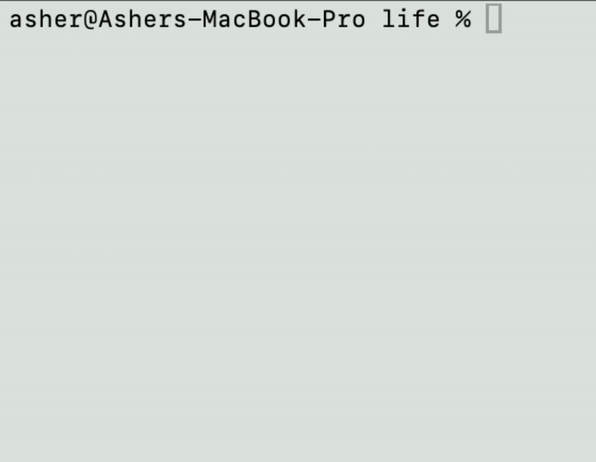

A simple conways game of life in c++, Swift, ObjC and Kotlin.
I wanted to test out using braille characters to multiply the usable pixels by 8 (4 rows 2 columns)

Set `MAP_SIZE` in the files file and compile with:

## C++

```bash
g++ life.cpp -o life

# then run with:
./life
```

## Swift

```bash
swiftc -parse-as-library -O Life.swift -o life
./life
```

## ObjC

```bash
clang -fobjc-arc -framework Foundation Life.m -o life
./life
```

## Kotlin with JVM

```bash
kotlinc Life-jvm.kt -include-runtime -d life.jar
java -jar life.jar
```

## Kotlin native

```bash
kotlinc-native Life-posix.kt -o life
./life.kexe
```


Make sure your terminal is big enough for the size.

